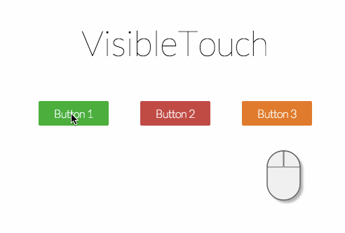
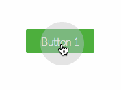
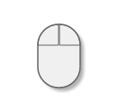
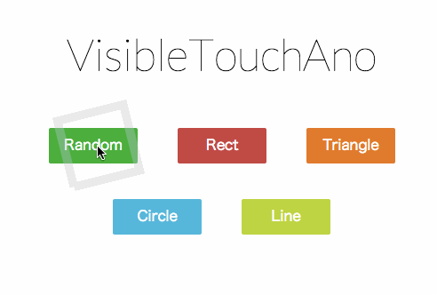

VisibleTouch.js
====
Mouse click visualizer written in JavaScript

##Demo
 

##Description
VisibleTouch.js is a JavaScript visualize program which shows mouse click action.

##How To Use
load script with [jQuery](http://jquery.com/)

    

showing click ripple

    
    

 

showing mouse image

    
    

 

showing both

    
    
    

with customize option

    
    
    

mousex: mouse image left position, if negative value it means potion from right  
mousey: mouse image top position, if negative value it means potion from bottom  
mousez: mouse image size

##Demo Page
http://aikelab.net/visibletouch/

##Extra
showing fancy ripple

    
    

 

##NOTE
If you click mouse buttons during draw ripples, the click event DO NOT notify to html page.

##Credit
VisibleTouch.js is licenced under MIT License. Copyright 2014, aike (@aike1000)
